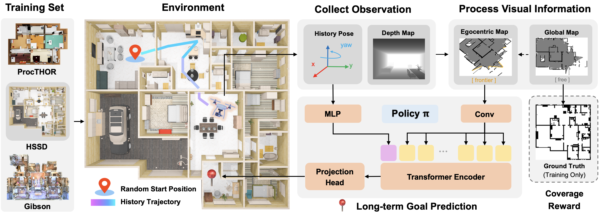
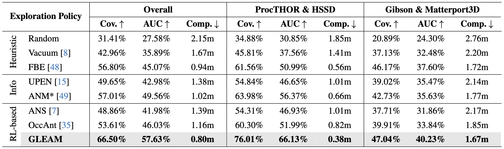

<p align="center">
<h1 align="center"><strong>GLEAM: Learning Generalizable Exploration Policy for Active Mapping in Complex 3D Indoor Scene</strong></h1>
  <p align="center">
    <!--   	<strong>CVPR 2024</strong><br> -->
    <a href='https://xiao-chen.tech/' target='_blank'>Xiao Chen</a>&emsp;
	  <a href='https://tai-wang.github.io/' target='_blank'>Tai Wang</a>&emsp;
    <a href='https://quanyili.github.io/' target='_blank'>Quanyi Li</a>&emsp;
    <a href='https://taohuang13.github.io/' target='_blank'>Tao Huang</a>&emsp;
	  <a href='https://oceanpang.github.io/' target='_blank'>Jiangmiao Pang</a>&emsp;
    <a href='https://tianfan.info/' target='_blank'>Tianfan Xue</a>&emsp;
    <br>
    The Chinese University of Hong Kong&emsp;Shanghai AI Laboratory
    <br>
  </p>
</p>


<div id="top" align="center">

[](https://xiao-chen.tech/gleam/)
[](https://github.com/zjwzcx/GLEAM-Bench)
[](https://arxiv.org/abs/2402.16174)


</div>

## 📋 Contents
1. [About](#-about)
2. [Getting Started](#-getting-started)
3. [Benchmark](#Benchmark)
4. [Citation](#-citation)
5. [License](#-license)


## 🏠 About
<div style="text-align: center;">
    
</div>
Generalizable active mapping in complex unknown environments remains a critical challenge for mobile robots. Existing methods, constrained by insufficient training data and conservative exploration strategies, exhibit limited generalizability across scenes with diverse layouts and complex connectivity. To enable scalable training and reliable evaluation, we introduce GLEAM-Bench, the first large-scale benchmark designed for generalizable active mapping with 1,152 diverse 3D scenes from synthetic and real-scan datasets. Building upon this foundation, we propose GLEAM, a unified generalizable exploration policy for active mapping. Its superior generalizability comes mainly from our semantic representations, long-term navigable goals, and randomized strategies. It significantly outperforms state-of-the-art methods, achieving 66.50% coverage (+9.49%) with efficient trajectories and improved mapping accuracy on 128 unseen complex scenes.


## 📚 Getting Started
### Installation

We test our code under the following environment:
- NVIDIA RTX 3090/4090 (24GB VRAM)
- NVIDIA Driver: 545.29.02
- Ubuntu 20.04
- CUDA 11.3
- Python 3.8.12
- PyTorch 1.11.0+cu113
- PyCUDA 2024.1


1. Clone this repository.

```bash
git clone https://github.com/zjwzcx/GLEAM
cd GLEAM
```

2. Create an environment and install PyTorch.

```bash
conda create -n gleam python=3.8 -y
conda activate gleam
pip install torch==1.11.0+cu113 torchvision==0.12.0+cu113 torchaudio==0.11.0 --extra-index-url https://download.pytorch.org/whl/cu113
```

3. NVIDIA Isaac Gym Installation: https://developer.nvidia.com/isaac-gym/download
```
cd isaacgym/python
pip install -e .
```

4. Install GLEAM.

```
pip install -r requirements.txt
pip install -e .
```

### Data Preparation

Please refer to the [guide](https://github.com/zjwzcx/GLEAM-Bench) for more details.
We provide all the preprocessed data used in our work, including mesh files and ground-truth surface points. We recommend users fill out the form to access the download link [[HERE](https://docs.google.com/forms/d/e/1FAIpQLSdq9aX1dwoyBb31nm8L_Mx5FeaVsr5AY538UiwKqg8LPKX9vg/viewform?usp=sharing)].

The directory structure should be as follows.

```
GLEAM
├── active_reconstruction
├── data_gleam
│   ├── train_stage1_512
│   │   ├── gt
│   │   ├── obj
│   │   ├── urdf
│   ├── train_stage2_512
│   │   ├── gt
│   │   ├── obj
│   │   ├── urdf
│   ├── eval_128
│   │   ├── gt
│   │   ├── obj
│   │   ├── urdf
├── ...
```

### Training

Please run the following command to reproduce the training setting of GLEAM:

```
python active_reconstruction/train/train_gleam_stage1.py --sim_device=cuda:0 --num_envs=512 --stop_wandb --headless
```

[Weights & Bias](https://wandb.ai/site/) (wandb) is highly recommended for analyzing the training logs. If you want to use wandb in our codebase, please paste your wandb API key into `wandb_utils/wandb_api_key_file.txt`. And then you need to run the following command to launch training:

```
python active_reconstruction/train/train_gleam_stage1.py --sim_device=cuda:0 --num_envs=512 --headless
```

### Customized Training Environments

If you want to customize a novel training environment, you need to create your environment and configuration files in `active_reconstruction/env` and then define the task in `active_reconstruction/__init__.py`.


### Evaluation

Please run the following command to evaluate the generalization performance of GLEAM on 128 unseen scenes from the test set of GLEAM-Bench.

```
python active_reconstruction/eval/eval_gleam_gleambench.py --sim_device=cuda:0 --num_envs=128 --stop_wandb=True
```


## 📦 Benchmark

More details of GLEAM-Bench can be found in https://github.com/zjwzcx/GLEAM-Bench.

### Overview

<p align="center">
  
</p>

### Main Results

<p align="center">
  
</p>


## 📝 TODO List
- \[x\] Release preprocessed dataset.
- \[ \] Release the paper and training code in May.
- \[ \] Release the evaluation scripts in May.


## 🔗 Citation
If you find our work helpful, please cite it:

```bibtex
@inproceedings{chen2025gleam,
  title={GLEAM: Learning Generalizable Exploration Policy for Active Mapping in Complex 3D Indoor Scenes},
  author={Chen, Xiao and Wang, Tai and Li, Quanyi and Huang, Tao and Pang, Jiangmiao and Xue, Tianfan},
  year={2025}
}
```

If you use our codebase, dataset and benchmark, please kindly cite the original datasets involved in our work. BibTex entries are provided below.

<details><summary>Dataset BibTex</summary>

  ```bibtex
@inproceedings{chen2024gennbv,
  title={GenNBV: Generalizable Next-Best-View Policy for Active 3D Reconstruction},
  author={Chen, Xiao and Li, Quanyi and Wang, Tai and Xue, Tianfan and Pang, Jiangmiao},
  year={2024}
  booktitle={IEEE Conference on Computer Vision and Pattern Recognition (CVPR)},
}
```
```bibtex
@inproceedings{procthor,
  author={Matt Deitke and Eli VanderBilt and Alvaro Herrasti and
          Luca Weihs and Jordi Salvador and Kiana Ehsani and
          Winson Han and Eric Kolve and Ali Farhadi and
          Aniruddha Kembhavi and Roozbeh Mottaghi},
  title={{ProcTHOR: Large-Scale Embodied AI Using Procedural Generation}},
  booktitle={NeurIPS},
  year={2022},
  note={Outstanding Paper Award}
}
```
```bibtex
@inproceedings{xiazamirhe2018gibsonenv,
  title={Gibson {Env}: real-world perception for embodied agents},
  author={Xia, Fei and R. Zamir, Amir and He, Zhi-Yang and Sax, Alexander and Malik, Jitendra and Savarese, Silvio},
  booktitle={Computer Vision and Pattern Recognition (CVPR), 2018 IEEE Conference on},
  year={2018},
  organization={IEEE}
}
```
```bibtex
@article{khanna2023hssd,
    author={{Khanna*}, Mukul and {Mao*}, Yongsen and Jiang, Hanxiao and Haresh, Sanjay and Shacklett, Brennan and Batra, Dhruv and Clegg, Alexander and Undersander, Eric and Chang, Angel X. and Savva, Manolis},
    title={{Habitat Synthetic Scenes Dataset (HSSD-200): An Analysis of 3D Scene Scale and Realism Tradeoffs for ObjectGoal Navigation}},
    journal={arXiv preprint},
    year={2023},
    eprint={2306.11290},
    archivePrefix={arXiv},
    primaryClass={cs.CV}
}
```
```bibtex
@article{Matterport3D,
  title={Matterport3D: Learning from RGB-D Data in Indoor Environments},
  author={Chang, Angel and Dai, Angela and Funkhouser, Thomas and Halber, Maciej and Niessner, Matthias and Savva, Manolis and Song, Shuran and Zeng, Andy and Zhang, Yinda},
  journal={International Conference on 3D Vision (3DV)},
  year={2017}
}
```
</details>

We're very grateful to the codebase of Legged Gym (https://github.com/leggedrobotics/legged_gym).

## 📄 License
<a rel="license" href="http://creativecommons.org/licenses/by-nc-sa/4.0/"></a>
<br />
This work is under the <a rel="license" href="http://creativecommons.org/licenses/by-nc-sa/4.0/">Creative Commons Attribution-NonCommercial-ShareAlike 4.0 International License</a>.
